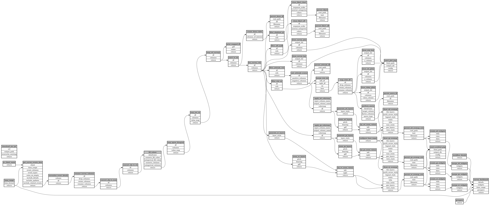

```
# AUTOGENERATED BY ECOSCOPE-WORKFLOWS; see fingerprint in README.md for details

```

```yaml
# fingerprint:
artifacts_sha256_basic: 6996fbf4898e68c2bfad6a3b41bccb04d07ec6b020d58962bb62efb1fdc6b681
artifacts_sha256_strict: 601644e5fa2d7b803831f085a54a240885700a5344778f48ddbc93538e64f0f6
installed_requirements:
- channel: https://repo.prefix.dev/ecoscope-workflows/
  name: ecoscope-workflows-core
  version: {version: ==0.14.0}
- channel: file:///tmp/ecoscope-workflows-custom/release/artifacts/
  name: ecoscope-workflows-ext-ate
  version: {version: ==10000.dev22+g68fcc0e2e.d20251027}
params_sha256: 4a7d0842fb0962bfad250f29d4a070a759539ab8679e6843141ddd61634da806
spec_sha256: f6955af5f975f7e9150581e7372a955ff013386de9ec06d9dac139d9c97ca3f6

```

# ecoscope-workflows-ate-survey-workflow


